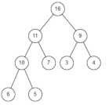

A binary heap is a type of data structure which can be easily represented in a program in array form, as demonstrated below:



``` [16, 11, 9, 10, 7, 3, 4, 6, 5] ```

 In order to compare these elements and determine which heap-type the array is, types being 'max-heap', 'min-heap' or 'no-heap, an algorithm can be written using the formula:

```Element[index] [comparison operator] Element[2 * i + 1] || Element[2 * i + 2]```

checking if ```index * 2 + 1``` is out of bounds with appropriate conditions.

This program will read from a text file which has arrays representing Binary structures, parses them, and determines which type of structure it belongs to. An example text file is already included.
